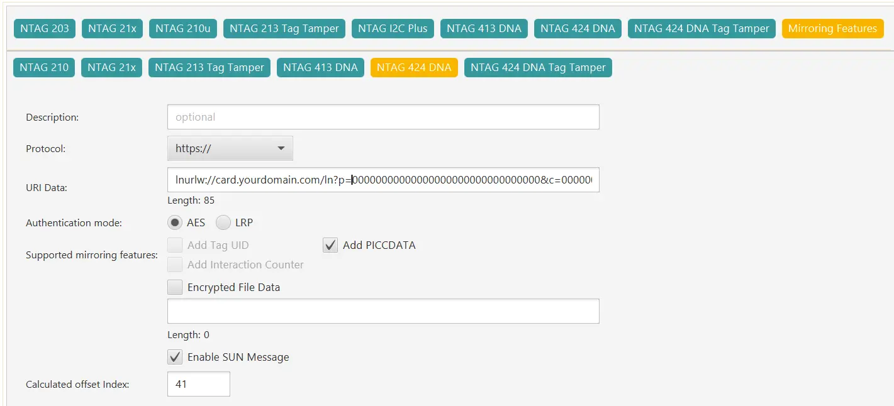
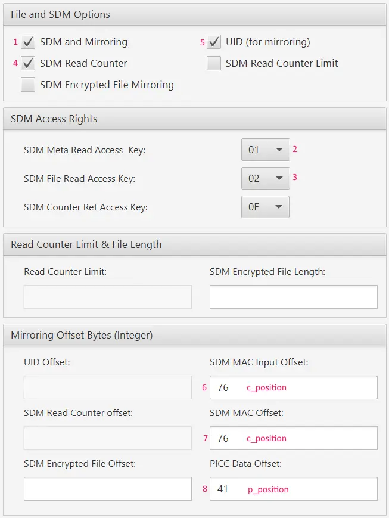

# Steps for making a bolt card with NXP TagXplorer software

## Introduction

Here we describe how to create your own bolt card with NXP TagXplorer software.

## Resources
 
- some cards
  - NXP DNA 424 NTAG cards

- a good NFC reader/writer
  - Identiv uTrust 3700 F

- software
  - [NXP TagXplorer software](https://www.nxp.com/products/rfid-nfc/mifare-hf/mifare-desfire/tagxplorer-pc-based-nfc-tag-reader-writer-tool:TAGXPLORER)
  - [Java Run Time environment](https://java.com/de/download/)

## Steps

### Connect to the card
- start the NFC TagXplorer software
- `Connect` to the NFC card reader
- place a card on the reader and click `Connect Tag`
- verify the card description


### Read the card
- select `NDEF Operations` and `Read NDEF`
- if you get this error, click `Format NDEF` and try again


- verify that the read completes without erroring

### Start to set up the URI template
- select `NTAG Operations`, `Mirroring Features` and `NTAG 424 DNA`
- set `Protocol` to `https://`
- set `URI Data` to
```
lnurlw://card.yourdomain.com/ln
```
- select `Add PICCDATA` and `Enable SUN Message`
- adjust the `URI Data` to
```
lnurlw://card.yourdomain.com/ln?p=00000000000000000000000000000000&c=0000000000000000
```

- click after `p=` and note the p_position (41 in this case)

- click after `c=` and note the c_position (76 in this case)
- select `Write To Tag`


- now go back to `NDEF Operations` and `Read NDEF`
- verify that the `NDEF Payload Info` is as expected


	 
### Finish setting up the URI template
- notice that the URI shows as `https://lnurlw://card ...` but we want `lnurlw://card ...`
- go to `NTAG Operations` and `NTAG 424 DNA`
- select `Read/Write data`
- select `File No` as `NDEF File - 02`
- click `Read`


- the NDEF file is `0057D1015355046C6E75726C ...`.
- look for the bytes `5504` (6 bytes from the start)
- `04` is the code for `https://` URI prepending
- change the `04` to `00` to indicate no prepending for the URI


- click `Write`


- now go back to `NDEF Operations` and `Read NDEF`
- verify that the `NDEF Payload(HEX) Info` is similar to that shown


- copy the hex data and convert to text, without the `0x00` prefix
- verify you have your expected `URI data` value  

[Online hex to text tool](http://www.unit-conversion.info/texttools/hexadecimal/)


### Set up the SUN authentication message
- go to `NTAG Operations` and `NTAG 424 DNA`
- select `Security Management` and click `Authentiate First`


- select `Get/Change File Settings`


- set up the values in the order shown



- select `Change File Settings`


- now go back to `NDEF Operations` and `Read NDEF`
- convert the hex data to text again
- verify that the `p` and `c` values are non zero
- select `Read NDEF` again
- convert the hex data to text again
- verify that the `p` and `c` values are in the right place
- verify that the `p` and `c` values change on each read
 
### Change the application keys
- go to `NTAG Operations` and `NTAG 424 DNA`
- select `Security Management`
- select `Authenticate`
- leave the `Card Key No` set to `00`
- leave the `Key` value set to `00000000000000000000000000000000` if not changed yet
- click `Authenticate First`


- select `Change Key`
- select the `Card Key No` to change the key value for `00` to `04`
- leave the `Old Key` value set to `00000000000000000000000000000000` if not changed yet
- enter a `New Key` value as required
- enter a `New Key Version` value of `00` or as required to keep track of your keys
- click `Change Key`


- repeat this to change all 5 application keys to your own values

### Lock the card
- go to `NTAG Operations` and `NTAG 424 DNA`
- select `Security Management` and click `Authentiate First`
- select `Get/Change File Settings`
- adjust the `Access Rights` settings as shown


## Testing
- set up a [bolt card service](INSTALL.md)
- add a record in the database for the new card
- use a merchant point of sale to scan your bolt card, e.g. [Breez wallet](https://breez.technology/)
- watch the bolt card service logs and verify that the requests are received and processed
