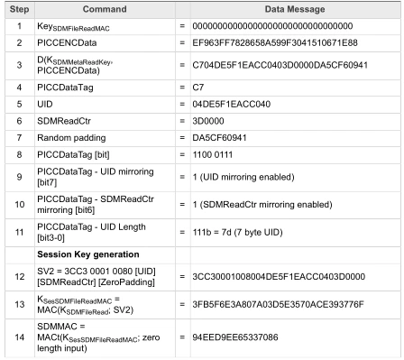

# Bolt card specification

The bolt card system is built on the open standards listed below.

- [LUD-03: withdrawRequest base spec.](https://github.com/fiatjaf/lnurl-rfc/blob/luds/03.md)
- [LUD-17: Protocol schemes and raw (non bech32-encoded) URLs.](https://github.com/fiatjaf/lnurl-rfc/blob/luds/17.md)

## Bolt card interaction

- the point-of-sale (POS) will read an NDEF message from the card, for example
```
lnurlw://card.yourdomain.com?p=A2EF40F6D46F1BB36E6EBF0114D4A464&c=F509EEA788E37E32
```
- the POS will call your server here
```
https://card.yourdomain.com?p=A2EF40F6D46F1BB36E6EBF0114D4A464&c=F509EEA788E37E32
```
- your server should verify the payment request and issue an LNURLw response

### Server side verification 
- for the `p` value and the `SDM Meta Read Access Key` value, decrypt the UID and counter
- for the `c` value and the `SDM File Read Access Key` value, check with AES-CMAC



- the authenticated UID and counter values can be used on your server to verify the request
- your server should only accept an increasing counter value
- additional validation rules can be added at your server, for example
  - an enable flag
  - payment limits
  - a list of allowed merchants
  - a verification of your location from your phone
- your server can then make payment from your lightning node

