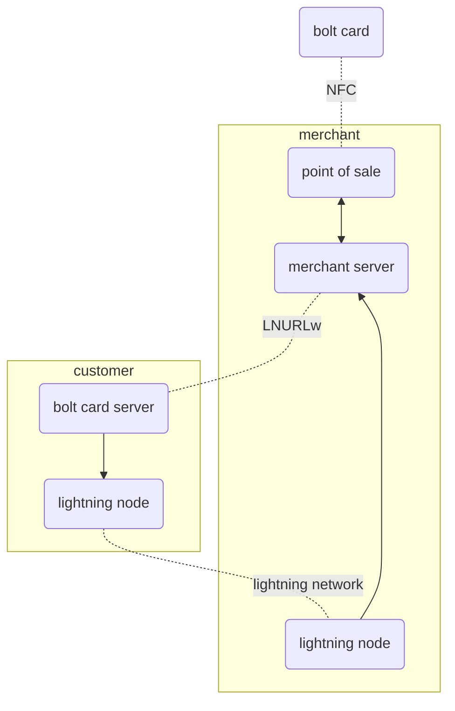
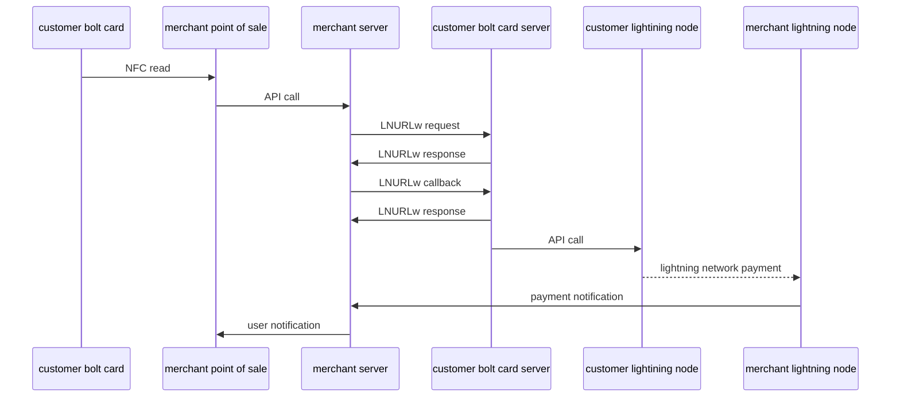

## System

The customer and the merchant must have a supporting infrastructure to make and accept payments using a bolt card.

### Interaction

```mermaid
flowchart TB
    BoltCard(bolt card)-. NFC .-PointOfSale(point of sale)
    MerchantServer(merchant server)-. LNURLw .-BoltCardServer(bolt card server)
    LightningNodeA(lightning node)-. lightning network .-LightningNodeB(lightning node)
    
    subgraph merchant
    PointOfSale<-->MerchantServer
    LightningNodeB-->MerchantServer
    end
    
    subgraph customer
    BoltCardServer-->LightningNodeA
    end
```

### Sequencing

```mermaid
sequenceDiagram
    participant p1 as customer bolt card
    participant p2 as merchant point of sale
    participant p3 as merchant server
    participant p4 as customer bolt card server
    participant p5 as customer lightining node
    participant p6 as merchant lightning node
    p1->>p2: NFC read
    p2->>p3: API call
    p3->>p4: LNURLw request
    p4->>p3: LNURLw response
    p3->>p4: LNURLw callback
    p4->>p3: LNURLw response
    p4->>p5: API call
    p5-->>p6: lightning network payment
    p6->>p3: payment notification
    p3->>p2: user notification
```
